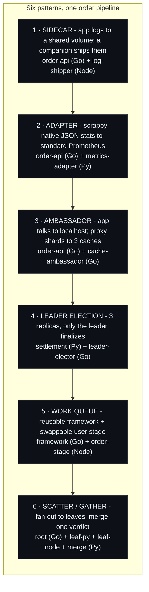
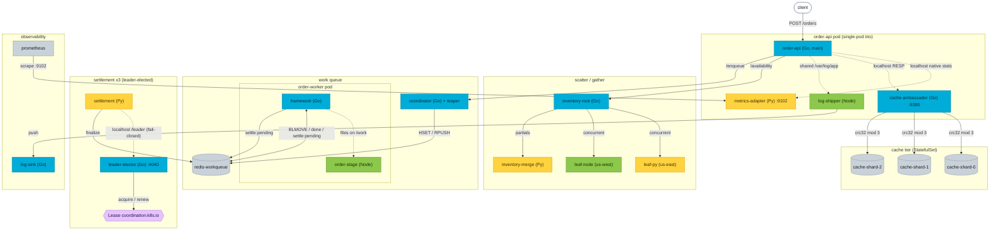
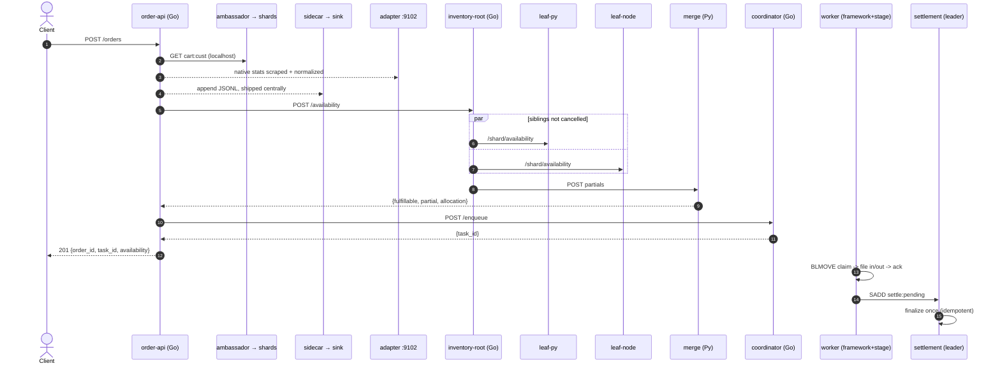

# OrderForge - six container patterns

Most write-ups of the classic multi-container patterns - **Sidecar, Adapter, Ambassador, Leader Election,
Work Queue, Scatter/Gather** - show you a diagram and move on. This repo is the opposite: **14 small,
deliberately polyglot services** (Go, Python, Node) wired into one order-processing pipeline where a single
order touches all six patterns, running on **any Kubernetes cluster** (the demo here ran on AWS EKS), with
a `make demo-*` that *proves* each pattern is doing what the diagram claims.

The polyglot mix is the point. Infrastructure containers - the log shipper, the metrics adapter, the cache
ambassador, the queue framework, the leader elector - never know or care what language the business logic is
written in. The strongest proof of that is the two warehouse leaves: **identical role, one in Python, one in
Node, behind one Go root**.

> Honest framing up front: the backing Redis instances are single-node `emptyDir` (non-durable) for
> teaching. A Redis restart wipes the `done`/`finalized` state, so the "exactly-once / no double-charge"
> guarantee holds only against a durable store (ElastiCache / SQS). client-go leader election is not a
> fencing token either; the **idempotent finalize** is what makes a brief two-leader overlap safe. The
> patterns are faithful; the durability is intentionally not.

## The six patterns, mapped

| # | Pattern | Where it lives in the pipeline | Containers (language) |
|---|---------|--------------------------------|-----------------------|
| 1 | **Sidecar** | Order API writes JSONL logs to a shared volume; a companion ships them centrally | order-api (Go) + log-shipper (Node) |
| 2 | **Adapter** | Order API emits scrappy native JSON stats; an adapter normalizes to Prometheus | order-api (Go) + metrics-adapter (Python) |
| 3 | **Ambassador** | Order API talks to `localhost` as one cache; the ambassador shards to 3 caches | order-api (Go) + cache-ambassador (Go) |
| 4 | **Leader Election** | Settlement runs 3 replicas; only the leader finalizes orders (no double-charge) | settlement (Python) + leader-elector (Go) |
| 5 | **Work Queue** | Coordinator enqueues; worker = reusable framework + swappable user stage | framework (Go) + order-stage (Node) |
| 6 | **Scatter/Gather** | Availability fans out to warehouse shards, then merges one verdict | inventory-root (Go) + leaf-py + leaf-node + inventory-merge (Python) |

Patterns 1-3 are the **single-pod trio** (they need only the pod's shared network namespace and shared
volume). Patterns 4-6 are the **cross-pod** patterns.



## Architecture



## One order's journey



## Run it

### Prerequisites
- `docker` (with buildx), `kubectl`, and access to a **Kubernetes cluster (v1.29+)** plus a container
  registry the cluster can pull from. Any conformant cluster works: kind, minikube, k3s, GKE, AKS, EKS,
  or on-prem.
- The v1.29+ floor is the only hard version requirement: the pods use **native sidecars** (initContainers
  with `restartPolicy: Always`), which are beta-by-default in 1.29 and GA in 1.33. That feature lives in the
  kubelet and API server, so it works the same on any distribution, no cloud required.
- Go/Python/Node are **not** required on your host - every image is a multi-stage in-container build.
- Only the AWS/EKS convenience path (`make push` / `make deploy`) additionally needs the `aws` CLI v2, for
  ECR and `update-kubeconfig`.

### Local sanity checks (no cluster)
```bash
make kustomize-check     # render all manifests offline
make build               # docker-build all 14 images (verifies they compile)
```

### Deploy to any cluster
The manifests in `deploy/kustomize/base` are vanilla Kubernetes. The only platform-specific step is getting
the images somewhere your cluster can pull from.

```bash
make build                               # build all 14 images locally as orderforge/<svc>:latest
# make them available to your cluster, either:
#   - push orderforge/<svc>:latest to a registry your cluster can pull from, or
#   - load them into a local cluster:  kind load docker-image orderforge/<svc>:latest
#                                      minikube image load orderforge/<svc>:latest
#     (loaded :latest images also need imagePullPolicy: IfNotPresent - the base manifests keep
#      the default Always, which would otherwise try to re-pull from Docker Hub and fail)
kubectl apply -k deploy/kustomize/base   # namespace: orderforge
kubectl -n orderforge get pods -w        # wait for Ready
make port-forward                        # svc/order-api -> localhost:32000 (separate terminal)
```

If you pushed to a registry, point the manifests at it by editing the `images:` block in
`deploy/kustomize/base/kustomization.yaml` (or add your own overlay) so `orderforge/<svc>` resolves to
`<your-registry>/<svc>`.

### Deploy to AWS EKS (the path used for the demo)
`make push` / `make deploy` automate the ECR and EKS specifics: create the ECR repos, build for the node
architecture, push, and apply the `overlays/eks` overlay (which rewrites images to your ECR and pins pods to
the node arch).

```bash
aws sso login                       # re-auth if your token expired
aws eks update-kubeconfig --name <cluster> --alias orderforge
kubectl auth whoami                 # confirm the role maps in (add an Access Entry if it 403s)

make push                           # build for the node arch + push every image to ECR
make deploy                         # apply overlays/eks (namespace: orderforge), images rewritten to your ECR
kubectl -n orderforge get pods -w   # wait for Ready
make port-forward                   # svc/order-api -> localhost:32000 (separate terminal)
```

`make push` auto-detects your node architecture (amd64 vs Graviton/arm64) and builds for it. Override with
`NODE_ARCH=arm64 make push` if detection is wrong.

### Prove each pattern
Each demo states its own execution context (a `kubectl exec` into the right container, or a dedicated
`port-forward`) so it runs non-interactively. Internal ports like `:9000`, `:9102`, `:4040` are only
reachable from inside the pod, which is exactly why the sidecars exist.

```bash
make demo-sidecar      # place an order, read the JSONL locally, find the SAME line in the central sink
make demo-adapter      # native :9000/stats vs normalized :9102/metrics - same numbers, two shapes
make demo-ambassador   # write N cart keys via the app, watch them split across 3 redis shards
make demo-scatter      # fan-out verdict; scale a leaf to 0 -> partial:true, still answered
make demo-workqueue    # enqueue orders, watch the done set grow, inspect a completed task hash
make demo-leader       # kill the leader pod, watch the Lease flip, non-leaders fail CLOSED
make demo-all          # all six in sequence
```

### Tear down
On any cluster, deleting the namespace removes every workload:
```bash
kubectl delete namespace orderforge
```
`make destroy` does the same with AWS-aware ordering (it deletes any Ingress first and waits for the ALB to
be released, so the load balancer isn't leaked), and `make destroy PURGE_ECR=1` also deletes the ECR repos.
On EKS this ordering matters for cost: the cluster, every ALB/NLB (~$16/mo each), and orphaned ECR repos all
bill.

## Repo layout
```
services/            14 polyglot services, each with a multi-stage Dockerfile
  order-api/(Go)  log-shipper/(Node)  metrics-adapter/(Py)  cache-ambassador/(Go)
  inventory-root/(Go)  warehouse-leaf-py/(Py)  warehouse-leaf-node/(Node)  inventory-merge/(Py)
  workqueue-coordinator/(Go)  workqueue-framework/(Go)  order-stage/(Node)
  settlement/(Py)  leader-elector/(Go)  log-sink/(Go)
deploy/kustomize/    base/ (portable vanilla k8s) + overlays/eks/ (AWS: ECR refs + arm64 nodeSelector)
scripts/             build-and-push.sh  deploy.sh  teardown.sh  demo/<pattern>.sh
docs/                design/CONTRACTS.md  diagrams/ (Mermaid)
```

`docs/design/CONTRACTS.md` is the single source of truth all 14 services conform to (Redis key convention,
the work-queue file handshake, the ambassador RESP subset, the leader `/leader` payload, envelope shapes).
It is what let the services be built independently without drifting.

## Why each pattern is *correct*, not just present
- **Work queue** claims tasks with `BLMOVE ready -> processing:<worker>` (never a bare `BLPOP`, which loses
  a task if the worker dies mid-pop). A reaper in the coordinator requeues expired inflight entries and any
  processing entry whose worker-liveness key has vanished, so no task is stranded.
- **Adapter** probes are **liveness-only**. A sick metrics sidecar must never evict the pod from its
  Service and take down user traffic; when upstream `/stats` is down it returns `orderforge_native_scrape_up 0`.
- **Leader election** is **fail-closed**: settlement treats any poll failure/timeout of `localhost:4040`, or
  a stale `leaseValidUntil`, as *not leader*, and finalize is idempotent so a failover overlap can't
  double-settle. A missing RBAC verb makes a pod never lead and never log why - so the Role is explicit.
- **Ambassador** speaks a real RESP subset so order-api uses a stock `go-redis` client and is genuinely
  oblivious to the three shards behind `localhost:6380`.
- **Scatter/Gather** gives each leaf its own timeout and **collects partials without cancelling siblings**,
  marking `partial:true` on any failure - latency tracks the slowest leaf, not the sum.

## Swapping in managed backends
The single-node Redis is for teaching. Each pattern maps onto a managed backend when you want durability, and
the application containers don't change - only what `localhost` and the backing stores point at. On AWS that
is **ElastiCache** for the cache shards and queue Redis, **SQS** for the work queue, **CloudWatch / Managed
Prometheus** for the adapter's output, and **ALB Ingress** for the front door; GKE, AKS, and on-prem have
direct equivalents (Memorystore / Cloud Tasks, Azure Cache / Storage Queues, and so on). That is the whole
thesis: the patterns are the stable interface.
